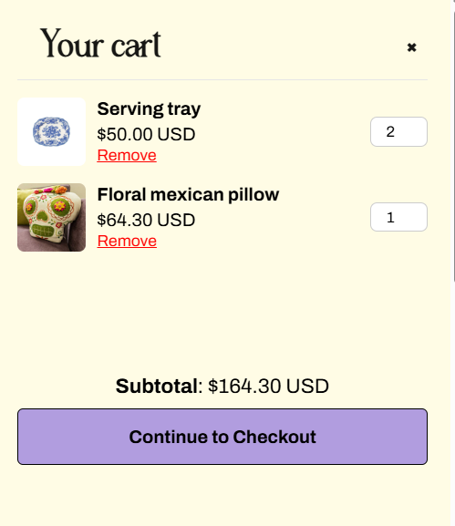

# DreamBin E-commerce Project

## 1. Project Overview

DreamBin is a simple and visually appealing e-commerce web application built for a handmade products store. The main goal of the project was to deliver a responsive and user-friendly front-end that allows users to browse products, view details, authenticate, and manage a shopping cart. The UI focuses on clean design and smooth navigation across devices.

## 2. Team Members and Contributions

| Team Member                        | Tasks                                                                                                                                                                                                                                                                          |
| ---------------------------------- | ------------------------------------------------------------------------------------------------------------------------------------------------------------------------------------------------------------------------------------------------------------------------------ |
| **Mostafa Ahmed Mohamed Rasheedy** | 1. Designed the Project structure   2. Authentication   3. Designed the Nav bar & (Hero, Shop Categories, Featured Products) Sections in landing page   4. Login Required to Add to Cart & Place Order logic   5. Featured Products & Search by product name logic |
| **Omnia Ahmed Mohamed Ahmed**      | 1. Document of the project   2. Designed the Footer & About us Section in landing page & 404 page   3. Ensured responsiveness across devices   4. Shop by Category logic   5. Invalid Product Handling (404 Page)                                                  |
| **Alaa Abdelhadi Zaki Abdelaziz**  | 1. Designed the All products & product details pages   2. Built the Product Details logic   3. Filtering by Categories   4. Filtering by Price and offers   5. Pagination                                                                                          |
| **Aya Ashour Noureldeen Mohamed**  | 1. Designed Login and Register pages   2. Handled form validation   3. Designed the Cart   4. Add & Remove to/from Cart   5. Choose Quantity of product in Cart logic                                                                                              |

## 3. Use Case

A handmade goods store owner approached us to create an elegant and functional front-end for their online business. The client wanted to allow customers to:

- Explore a wide range of handcrafted items,
- View detailed product information,
- Register or log in to an account,
- And shop smoothly using a cart system.

The client provided branding guidance, including a mint-colored floral theme and asked for a simple, responsive design suitable for both desktop and mobile users.

Our team delivered a client-side front-end solution that fulfills these requirements, ready for future integration with a back-end system.

## 4. Project Features and Technical Details

### Shop by Category

Users can browse products by predefined categories like Gifts, Dining, Serveware, Furnishing, Bags, and Watches. Each category displays relevant products with visuals.

### Featured Products

Highlights selected items with image, name, and price. Offers users a curated experience for quick access to popular or seasonal items.

### Filtering by Category & Price

Users can filter products dynamically based on category and price ranges. Enhances the shopping experience by allowing targeted product discovery.

### Pagination

Product listings are paginated to improve loading performance and user experience. Enables users to browse through multiple product sets efficiently.

### Authentication

Secure login and registration forms with validations (email format, password strength, required fields). Session control ensures personalized experiences for logged-in users only.

### Product Details View

Clicking on a product shows full information: images, description, and price. Includes ‘Add to Cart’ option (only accessible when logged in).

### Login Required to Add to Cart

Guests can browse products but must log in to add items to the cart. Prevents unauthorized access to cart-related actions.

### Cart Management

Users can add or remove products from the cart. Cart displays item quantities, prices, and total cost.

### Place Order

After reviewing the cart, users can proceed to place an order. The flow is designed for smooth transition from browsing to checkout.

### Search

A search bar helps users find products by name or keyword. Results update based on the user's input to narrow down product matches.

### Invalid Product Handling (404 Page)

If a user tries to navigate to a product that does not exist in the JSON file (e.g., by entering an invalid URL or product ID), they are redirected to a custom 404 page.

## Project Screenshots

### Homepage

### All Products

### Product Details

### Cart Page

### 404 Error Page

## Technical Notes

- Built using HTML, CSS and JavaScript for interactivity.
- Live Demo : https://dreambin.netlify.app/
- Fully responsive UI for desktop and mobile views.
- Ready to connect with back-end APIs for full e-commerce functionality.
